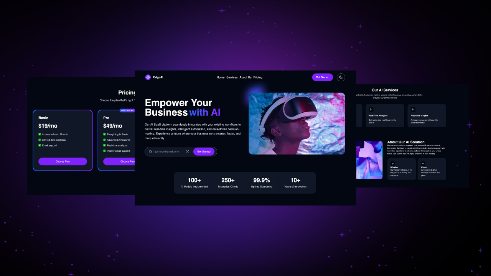

# AI SaaS Landing Page

## Project Banner
**Tech Stack:** React · Tailwind CSS · Vite · TypeScript · Zustand

**Build a Beautiful, Modern Landing Page for Your AI SaaS**



---

## 📋 Table of Contents
- [Tech Stack](#-tech-stack)
- [Features](#-features)
- [Quick Start](#-quick-start)

---

## ⚙️ Tech Stack
- **React** – For building the user interface
- **Vite** – For fast development and optimized builds
- **Tailwind CSS** – For rapid, responsive styling using a design token system
- **TypeScript** – For type safety and modern JavaScript features
- **Zustand** – For lightweight state management and theme persistence

---

## ⚡️ Features
### Modern Landing Page Design
A sleek, responsive design that highlights your AI SaaS product’s unique value proposition.

### Dark/Light Mode
Seamlessly toggle between dark and light themes with Zustand and Tailwind CSS design tokens.

### Interactive Components
Build reusable sections such as Hero, Features, Pricing, and CTA using React components.

### Animated Elements
Smooth hover animations and gradient effects for a dynamic user experience.

### State Management
Global UI state management with Zustand ensures persistent theme settings across sessions.

---

## 👌 Quick Start

### Prerequisites
- Git
- Node.js
- npm

### Cloning the Repository
```bash
git clone https://github.com/ba7rIbrahim/Landing-Page-EdgeAI-.git
cd ai-saas-landing-page
